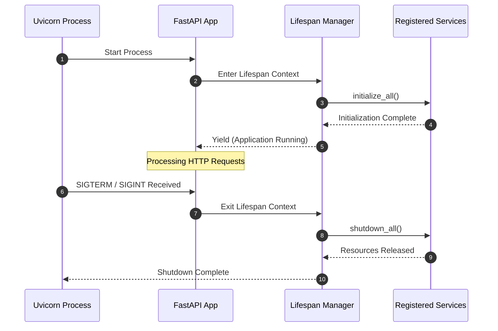
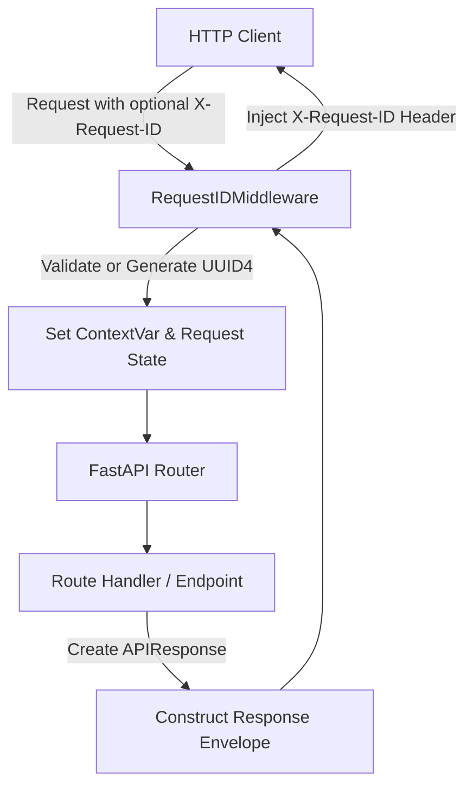
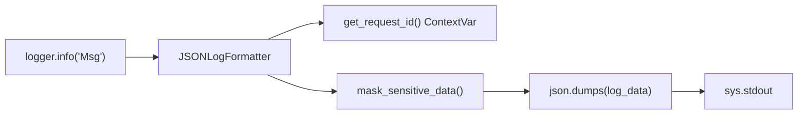
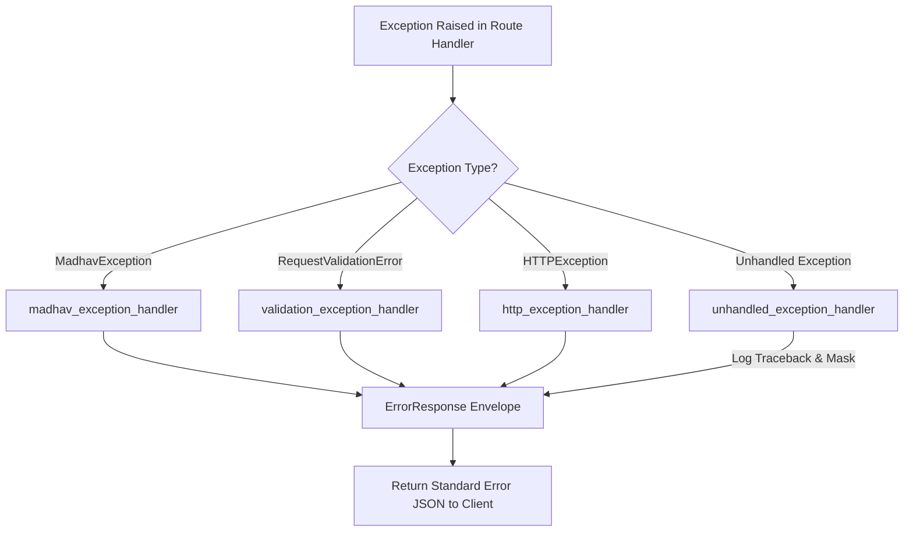

# Architecture Specification — Module 01: Platform Foundation

## 1. Purpose

Module 01 provides the core runtime foundation, application lifecycle, request correlation, error handling, structured logging, health monitoring, and developer tooling for the MADHAV Personal AI System. It serves as the baseline upon which all subsequent 40 MADHAV modules are constructed.

---

## 2. Responsibilities

- **Application Composition**: Application factory pattern (`create_app()`) creating FastAPI instances with lifespan lifecycle hooks.
- **Request Correlation**: Generation and propagation of unique correlation IDs (`X-Request-ID`) via context variables across standard logs and API responses.
- **Structured Logging**: JSON-formatted logging emitting standardized ISO-8601 timestamps, log level, service identity, correlation ID, and automatic masking of sensitive credentials.
- **Unified Exception Architecture**: Hierarchical exception classes (`MadhavException`, `ApplicationError`, `ValidationError`, `NotFoundError`, `InternalError`) mapped to standardized JSON error responses.
- **Health & Readiness Endpoints**: Liveness (`/health`), readiness (`/ready`), and service identity (`/`) endpoints.
- **Base Interfaces**: Extensible runtime protocols for `ServiceLifecycle` and `HealthCheckProvider`.
- **Quality & CI Infrastructure**: Strict MyPy typing, Ruff linter/formatter rules, Pytest test suite, verification scripts, and GitHub Actions workflow.

---

## 3. Non-Responsibilities

- **Configuration Management**: Environment variable management belongs to Module 02.
- **Identity & Profile**: Auth, user accounts, and personal profiles belong to Module 03.
- **AI Runtimes, Memory, & Agents**: LLM orchestration, vector databases, tool execution, and agents belong to Modules 04–41.
- **Persistence & External Services**: Database connections, Redis, or external APIs are excluded from Module 01.

---

## 4. Package Structure

```
src/madhav/
├── __init__.py           # Package exports
├── main.py               # Uvicorn entry point
├── api/
│   ├── __init__.py
│   ├── router.py         # Router composition and v1 prefix registration
│   └── health.py         # Root, health, and readiness handlers
├── core/
│   ├── __init__.py
│   ├── application.py    # App factory create_app()
│   ├── lifecycle.py      # Lifespan context manager and manager registry
│   ├── exceptions.py     # Base & derived exception classes
│   ├── error_handlers.py # FastAPI exception handler registrations
│   ├── logging.py        # Structured JSON formatter and secret masking
│   ├── request_id.py     # Correlation ID ASGI middleware and contextvars
│   └── responses.py      # APIResponse and ErrorResponse Pydantic models
├── common/
│   ├── __init__.py
│   ├── types.py          # Enums and foundational types
│   └── interfaces.py     # Core protocols (ServiceLifecycle, HealthCheckProvider)
└── version.py            # Central app metadata
```

---

## 5. Application Lifecycle

The application lifecycle uses FastAPI's `lifespan` context manager mechanism.



---

## 6. Request Lifecycle & Request ID Flow

Every incoming request passes through the `RequestIDMiddleware` which extracts or generates an `X-Request-ID`.



---

## 7. Logging Flow

All log statements automatically pull the request correlation ID from the thread/async context:



---

## 8. Error Handling Flow

Unhandled and domain exceptions are intercepted centrally by FastAPI exception handlers:



---

## 9. Health & Readiness Architecture

- **`GET /health`**: Liveness probe. Indicates the process is alive and receiving traffic.
- **`GET /ready`**: Readiness probe. Executes checks across registered `HealthCheckProvider` instances.
- **`GET /`**: Returns identity metadata (`APP_NAME`, `SERVICE_NAME`, `VERSION`).

---

## 10. Testing Strategy

The test suite enforces full coverage over foundation components:
- **Unit Tests**:
  - `test_health.py`: Endpoint structure and response validation.
  - `test_exceptions.py`: Custom exception attributes and stack trace masking.
  - `test_logging.py`: Structured JSON output formatting and secret sanitization.
  - `test_request_id.py`: Header parsing, UUID fallback, and context propagation.
- **Integration Tests**:
  - `test_application.py`: Lifecycle startup/shutdown execution and service manager integration.

---

## 11. Extension Points

Future modules extend Module 01 foundation using well-defined protocols:
1. **Service Lifecycle**: Implementing `ServiceLifecycle` and registering with `get_lifecycle_manager().register_service(...)`.
2. **Health Provider**: Implementing `HealthCheckProvider` and registering with `register_readiness_provider(...)`.
3. **API Routing**: Registering new route modules within `register_routers(...)` or `/api/v1` router prefix.

---

## 12. Future Module Boundaries

Module 01 intentionally excludes:
- Persistent storage schemas or ORM models.
- Authentication tokens or user session validation.
- External API integrations or LLM provider clients.
- Background task queues or schedulers.
