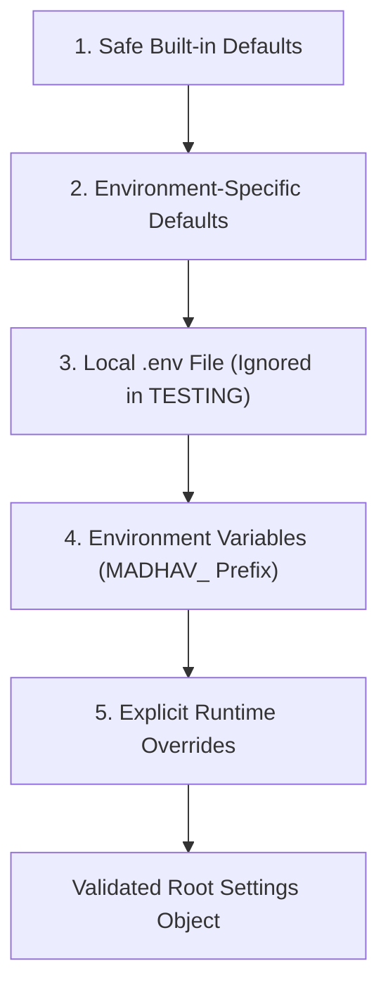

# Architecture Specification — Module 02: Configuration & Environment

## 1. Purpose

Module 02 establishes a centralized, strongly typed, environment-aware configuration framework for the MADHAV Personal AI platform. It replaces direct `os.getenv()` calls across modules with a single source of truth (`Settings`), providing environment resolution, strict validation, secret redaction, and seamless FastAPI integration.

---

## 2. Responsibilities

- **Strongly Typed Settings**: Uses `pydantic-settings` to parse, validate, and structure configuration settings across 7 distinct categories.
- **Environment Precedence**: Enforces a strict 5-tier configuration loading order (`defaults -> environment-specific -> .env -> environment variables -> runtime overrides`).
- **Secret Masking & Redaction**: Protects secret credentials (`SecretStr`) from leaking into logs, diagnostics (`python -m madhav.config`), or API responses via `redacted()` / `safe_dict()`.
- **Validation Boundaries**: Enforces valid ports (1-65535), log levels, and production safety constraints (`debug=False` required, CORS origin wildcard prohibited when credentials are enabled).
- **FastAPI Integration**: Dynamically configures application titles, docs (`/docs`, `/redoc`), OpenAPI schemas, CORS middleware, and structured logging based on active settings.
- **Deterministic Test Isolation**: Autouse fixtures enforce `Environment.TESTING` during Pytest runs, preventing developer `.env` pollution.

---

## 3. Package Structure

```
src/madhav/config/
├── __init__.py           # Exports Settings, get_settings, Environment, ConfigurationError
├── __main__.py          # CLI diagnostic entry point (python -m madhav.config)
├── enums.py              # Environment (DEVELOPMENT, TESTING, PRODUCTION)
├── errors.py             # ConfigurationError exception
├── loader.py             # Environment loading strategies
├── sections.py           # Application, Server, API, Logging, Security, CORS, FeatureFlags sub-models
├── settings.py           # Root Settings pydantic-settings model and get_settings() getter
└── validators.py         # Network, logging, and production safety validation functions
```

---

## 4. Configuration Loading Precedence

Configuration settings are resolved following a deterministic hierarchy:



Environment variables use double underscores for nested categories:
- `MADHAV_APPLICATION__ENVIRONMENT=production`
- `MADHAV_SERVER__PORT=8000`
- `MADHAV_LOGGING__LEVEL=INFO`

---

## 5. Secret Handling & Redaction Boundary

Secret fields (such as `security.secret_key`) are represented as `pydantic.SecretStr` instances.

```mermaid
graph LR
    Settings["Settings Object"] -->|get_settings()| App["Application Core"]
    Settings -->|redacted() / safe_dict()| Diagnostics["CLI Diagnostic Output"]
    Settings -->|redacted() / safe_dict()| Logging["Structured Log Formatter"]
    
    subgraph Secret Boundaries
    App -->|Raw SecretStr| Auth["Future Security Modules"]
    Diagnostics -->|***REDACTED***| stdout["Safe Stdout Output"]
    Logging -->|***REDACTED***| Logs["Sanitized JSON Logs"]
    end
```

---

## 6. Environment Resolution & Production Safeguards

Supported environments are represented by the `Environment` enum:
- **`DEVELOPMENT`**: Local dev defaults, interactive docs (`/docs`, `/redoc`), hot-reload support.
- **`TESTING`**: Isolated deterministic defaults, disabled `.env` inheritance.
- **`PRODUCTION`**: Strict validation rules:
  - Reject `debug=True`.
  - Reject CORS wildcard origin `"*"` when `allow_credentials=True`.
  - Require non-empty `allowed_hosts`.

---

## 7. Extension Points for Future Modules

Future modules consume settings via `get_settings()` without directly reading `os.getenv(...)`:

```python
from madhav.config import get_settings

settings = get_settings()
# Access typed configuration categories:
# settings.application
# settings.server
# settings.api
# settings.logging
# settings.security
# settings.cors
# settings.features
```

Future modules (e.g. Identity, AI Runtime, RAG, Memory) add section models to `sections.py` and mount them onto `Settings` in `settings.py`.
