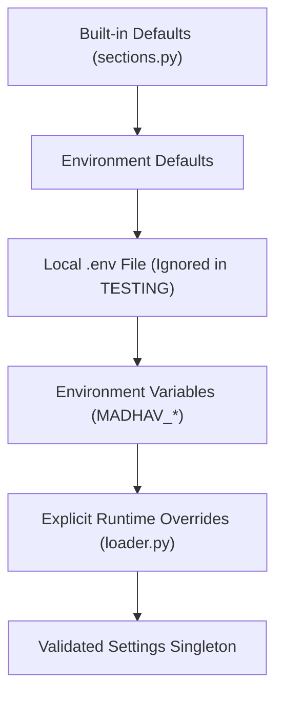
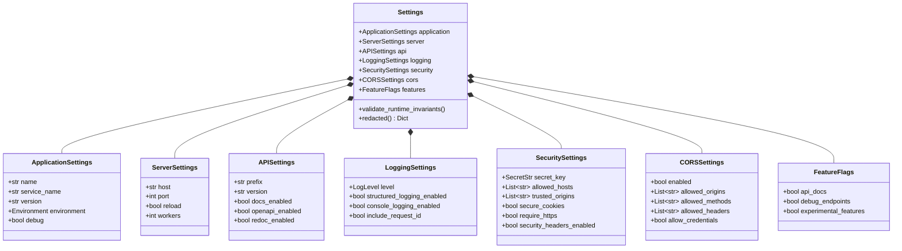
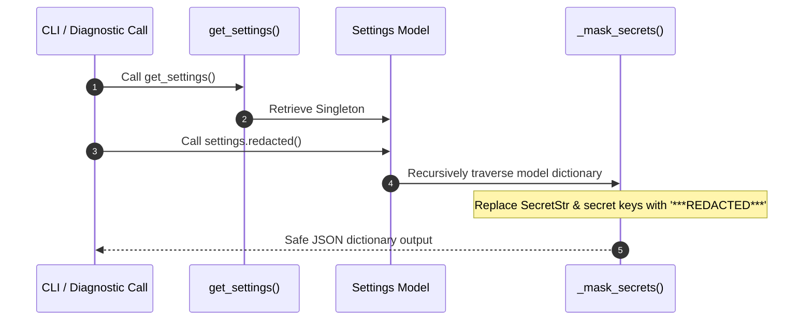
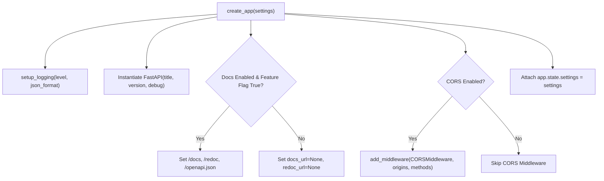

# Architecture Specification — Module 02: Configuration & Environment

## 1. Purpose

Module 02 provides a centralized, strongly typed, environment-aware configuration architecture for the MADHAV Personal AI System. It establishes `get_settings()` as the single source of truth for runtime configuration across all platform modules, eliminating raw `os.getenv()` calls.

---

## 2. Responsibilities

- **Centralized Source of Truth**: Unified Pydantic Settings model hierarchy (`Settings`).
- **Environment Awareness**: Strongly typed execution environments (`development`, `testing`, `production`, `staging`).
- **Precedence Management**: Hierarchical settings loading combining built-in defaults, `.env` files, and `MADHAV_` environment variables.
- **Secret Redaction**: Automatic masking of `SecretStr` fields into `"***REDACTED***"` in log outputs, health responses, and CLI diagnostics (`safe_dict()` / `redacted()`).
- **Startup Validation**: Invariant enforcement checking port limits (1–65535), log levels, and production safety invariants (debug mode prohibition, wildcard CORS credential checks, placeholder secret keys).
- **FastAPI Integration**: Dynamic configuration of app metadata, interactive docs (`/docs`, `/redoc`, `/openapi.json`), CORS middleware, and logging level.
- **Test Isolation**: Guaranteeing deterministic test execution under `Environment.TESTING` without reading developer `.env` files.

---

## 3. Configuration Hierarchy & Precedence

Configuration values are resolved in the following strict hierarchy:

---

## 4. Settings Architecture

The configuration model is structured into domain-specific Pydantic sections:

---

## 5. Secret Handling & Redaction Boundary

Secret values are stored as Pydantic `SecretStr` instances. When emitting diagnostics or inspecting configuration via CLI:

---

## 6. Startup Validation & Production Invariants

Before runtime initialization completes, `validate_runtime_invariants()` verifies:
1. `server.port` is bounded between 1 and 65535.
2. `logging.level` matches a valid `LogLevel` value.
3. If `application.environment == Environment.PRODUCTION`:
   - `application.debug` MUST be `False`.
   - `cors.allowed_origins` MUST NOT contain wildcard `"*"` if `cors.allow_credentials` is `True`.
   - `security.secret_key` MUST NOT be the default development placeholder string.

---

## 7. FastAPI Integration Flow

The application factory (`create_app`) receives `Settings` and configures server infrastructure:

---

## 8. Extension Points for Future Modules

Subsequent MADHAV modules (03 to 41) will extend Module 02 configuration by creating new section models in `src/madhav/config/sections.py` and referencing them in `Settings`:
- Module 03 (Identity): `settings.identity`
- Module 04 (AI Runtime): `settings.ai`
- Module 05 (Model Management): `settings.models`
- Module 08 (Memory Engine): `settings.memory`
- Module 10 (RAG & Retrieval): `settings.rag`

Future modules consume settings via `get_settings()` dependency injection without needing to alter core loading mechanics or environment variable resolution.
