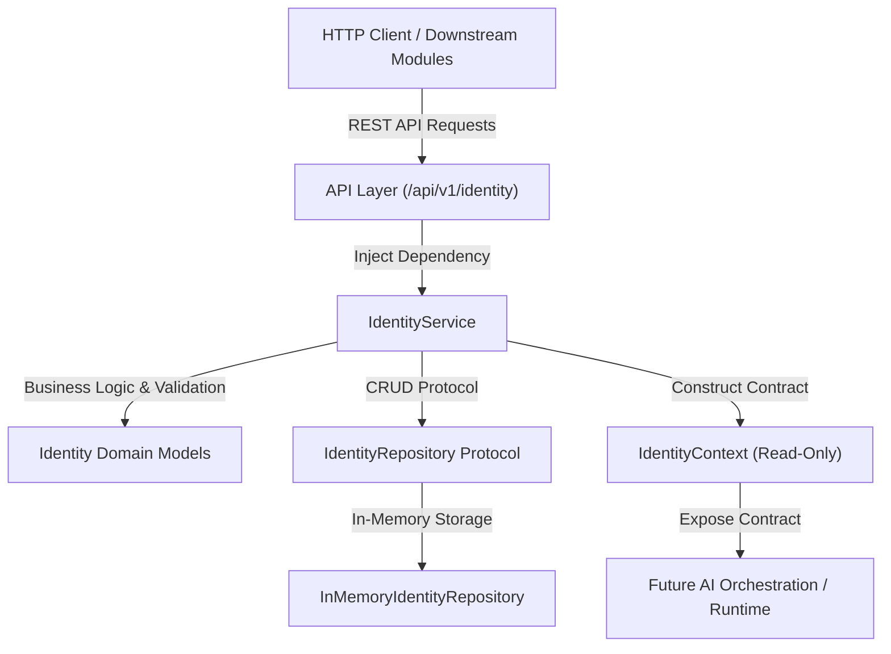
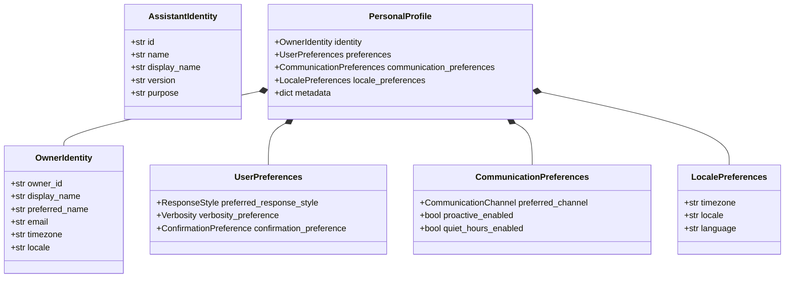

# Architecture Specification — Module 03: Identity & Personal Profile

## 1. Purpose

Module 03 establishes the formal **Identity & Personal Profile Subsystem** for the MAX Personal AI platform. It answers the foundational question *"Who is the person Max is serving?"* by providing domain models for Assistant Identity, Owner Identity, Personal Profile, and structured User/Communication/Locale Preferences.

---

## 2. Scope

Module 03 encompasses:
- Assistant & Owner Identity models.
- Structured User, Communication, and Locale Preference models.
- Personal Profile composition and `IdentityContext` domain contract.
- Abstract `IdentityRepository` protocol and `InMemoryIdentityRepository` implementation.
- `IdentityService` providing profile update logic, IANA timezone/locale validation, privacy sanitization, and deterministic completeness calculation (0-100%).
- REST API layer under `/api/v1/identity`.

---

## 3. High-Level Architecture



---

## 4. Domain Model Hierarchy



---

## 5. Assistant Identity

The assistant identity (`AssistantIdentity`) represents MAX itself:
- **Default Name**: `"Max"` (configured via settings).
- **Default Display Name**: `"MAX Personal AI"`.
- **Purpose**: Serve, assist, manage personal knowledge, and empower the owner autonomously.

---

## 6. Owner Identity

The owner identity (`OwnerIdentity`) represents the primary human user:
- Supports partial profiles (all personal attributes are optional except `owner_id`).
- Default values remain strictly neutral (`display_name = None`, `email = None`).
- Zero fake personal data is injected at startup.

---

## 7. Preferences Architecture

- **`UserPreferences`**: High-level response style (`CONCISE`, `BALANCED`, `DETAILED`), verbosity (`LOW`, `MEDIUM`, `HIGH`), and confirmation rules (`ALWAYS`, `SENSITIVE_ACTIONS`, `NEVER`).
- **`CommunicationPreferences`**: Channel preference (`TEXT`, `VOICE`, `SYSTEM_NOTIFICATION`), proactive messaging toggles, and quiet hours windows (`22:00` to `07:00`).
- **`LocalePreferences`**: IANA timezone identifier (`Asia/Kolkata`, `UTC`), BCP 47 locale tag (`en_US`), language, country, and regional formatting.

---

## 8. IdentityContext Domain Contract

The `IdentityContext` abstraction enables downstream modules (Context Engine, Reasoning, Tools, Orchestration) to consume owner and assistant attributes without accessing internal repository state:

```python
from max.identity import IdentityService

identity_service = IdentityService()
ctx = await identity_service.build_identity_context()

# Read-only attributes for AI prompt construction or decision making:
assistant_name = ctx.assistant.name
owner_name = ctx.owner_name  # Returns preferred_name or fallback
timezone = ctx.profile.locale_preferences.timezone
```

---

## 9. Repository Abstraction & In-Memory Storage

Storage operations decouple business logic from underlying databases via `IdentityRepository`:
- **Module 03 Implementation**: `InMemoryIdentityRepository` using thread-safe `asyncio.Lock`.
- **Future Persistence Strategy**: Future modules can implement `PostgresIdentityRepository` matching the `IdentityRepository` protocol without altering `IdentityService` or API handlers.

---

## 10. Service Layer & Business Validation

`IdentityService` implements business rules:
- **IANA Timezone Validation**: Validated via Python's standard `zoneinfo.ZoneInfo`.
- **Email Validation**: Formatted using strict RFC regular expression validation.
- **Completeness Calculation**: Deterministic score (0–100%) based on 10 recommended profile attributes:

$$\text{Completeness (\%)} = \left( \frac{\text{Completed Recommended Fields}}{10} \right) \times 100$$

- **Safe Identity Summary**: `SafeIdentitySummary` serializes non-sensitive overview fields (`owner_id`, `preferred_name`, `timezone`, `locale`, `completion_percentage`) for safe log logging and diagnostic output.

---

## 11. API Endpoints

All endpoints are mounted under `/api/v1/identity`:

| HTTP Method | Route | Description |
|---|---|---|
| `GET` | `/api/v1/identity/assistant` | Retrieve active assistant identity |
| `GET` | `/api/v1/identity/owner` | Retrieve active owner identity |
| `GET` | `/api/v1/identity/profile` | Retrieve complete personal profile |
| `GET` | `/api/v1/identity/summary` | Retrieve non-sensitive safe summary |
| `GET` | `/api/v1/identity/preferences` | Retrieve user preferences |
| `PUT` | `/api/v1/identity/profile` | Atomic update of profile sections |
| `PATCH` | `/api/v1/identity/preferences` | Partial update of user preferences |
| `PATCH` | `/api/v1/identity/communication` | Partial update of communication preferences |
| `PATCH` | `/api/v1/identity/locale` | Partial update of locale preferences |
| `GET` | `/api/v1/identity/completeness` | Retrieve profile completeness metric & missing fields |

---

## 12. Privacy & Security Boundaries

- **Authentication Decoupling**: Identity answers *"Who is Max serving?"*, not *"Who is authorized to access Max?"*. Authentication (OAuth/JWT/passwords) is explicitly excluded from Module 03.
- **Log Sanitization**: Logs output high-level actions (`Updated owner identity owner_id=...`) without logging sensitive personal data (email, phone, date of birth, bio).
- **Secret Redaction**: Secret keys are prohibited from identity profile structures.

---

## 13. Explicit Non-Goals

- No database ORMs (SQLAlchemy / Alembic / Postgres).
- No authentication tokens, passwords, or user login systems.
- No conversational memory or vector retrieval (RAG).
- No AI model inference or LLM prompts.
