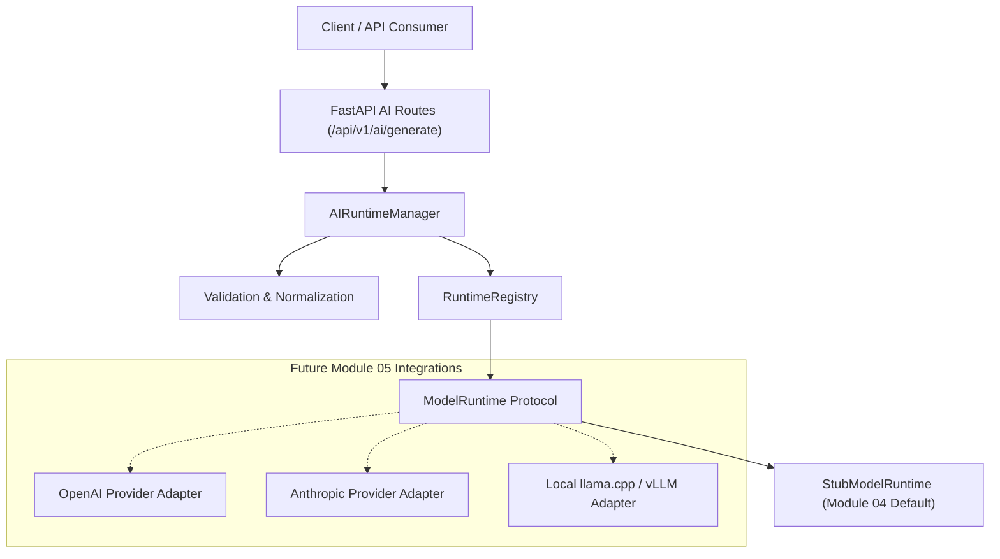

# Module 04 — AI Runtime

## 1. Purpose

The AI Runtime module provides a provider-neutral, strongly typed execution boundary for AI model inference within the MAX Personal AI platform. It isolates upper-level orchestrators, agents, and API handlers from vendor-specific LLM providers, model runtimes, and local inference engines.

## 2. Responsibilities

- **Inference Request Lifecycle**: Validates incoming AI generation requests, constructs internal execution models, executes inference via an abstraction layer, normalizes responses, and measures execution timing.
- **Provider Neutrality**: Encapsulates all backend interactions behind the `ModelRuntime` protocol and `RuntimeRegistry`.
- **Fault Tolerance & Resilience**: Handles request timeouts, cancellation propagation, runtime failure normalization, and error classification.
- **Execution Metadata & Auditability**: Measures monotonic execution duration, collects standard usage metrics (where provided), and logs privacy-safe runtime operations.
- **Development Stub Runtime**: Includes `StubModelRuntime` to guarantee 100% offline development, testing, and CI capability without requiring LLM API credentials or local model weights.

## 3. Non-Responsibilities

- **Model Management** (Module 05): Model discovery, routing, lifecycle, downloading, and weight management.
- **Context & Conversation Engine** (Modules 06–07): Memory retrieval, prompt engineering, system prompt generation, dynamic personality, or message context assembly.
- **Tool / Agent Execution** (Modules 08–20): Tool invocation, agent planning, computer control, or RAG operations.
- **Persistence**: Database storage, Redis caching, or session state.

## 4. Architecture Diagram



## 5. Core Domain Concepts

### `AIMessage`
Provider-neutral representation of a chat message.
- `role`: `system`, `user`, `assistant` (`AIRole` enum).
- `content`: Non-empty string payload.

### `GenerationParameters`
Configurable inference controls:
- `temperature`: `[0.0, 2.0]` (Default: `0.7`).
- `top_p`: `[0.0, 1.0]` (Default: `1.0`).
- `max_tokens`: Positive integer (Default: `1024`).
- `stop_sequences`: Optional list of stopping strings.

### `AIRequest`
Input request container:
- `request_id`: Monotonic UUID string.
- `messages`: List of valid `AIMessage` items.
- `generation`: `GenerationParameters`.
- `timeout_seconds`: Optional per-request timeout override.
- `stream`: Boolean indicating streaming preference.

### `AIResponse`
Normalized inference output envelope:
- `request_id`: Associated request ID.
- `content`: Generated text response.
- `finish_reason`: `stop`, `length`, `cancelled`, `error`, `unknown`.
- `usage`: `AIUsage` object (input_tokens, output_tokens, total_tokens) or `None`.
- `execution`: `AIExecutionMetadata` (duration_ms, provider, model, timestamps, success).
- `model_reference`: Model identifier string (e.g., `stub-development-model`).
- `provider`: Provider identifier string (e.g., `stub`).

## 6. Runtime Registry & Provider Abstraction

The `RuntimeRegistry` acts as a lookup mechanism mapping provider names (`"stub"`, `"openai"`, `"llama_cpp"`) to concrete implementations of the `ModelRuntime` Protocol.

```python
class ModelRuntime(Protocol):
    async def generate(self, request: AIRequest) -> AIResponse: ...
    async def health(self) -> RuntimeStatus: ...
    async def capabilities(self) -> RuntimeCapabilities: ...
```

## 7. Error Handling & Privacy

- **Safe Logging**: Full prompts and generated responses are **never** logged by default to protect personal user data. Only request IDs, provider names, model references, and execution durations are recorded in structured logs.
- **Normalized Exceptions**:
  - `AIValidationError`: Malformed input requests or invalid parameters.
  - `AIRuntimeUnavailableError`: Requested backend runtime not registered.
  - `AIInferenceTimeoutError`: Inference execution exceeded configured timeout limit.
  - `AIInferenceCancelledError`: Request cancelled by caller.
  - `AIResponseValidationError`: Model response violated runtime format contracts.

## 8. Development & Offline Guarantee

The system defaults to `AI_RUNTIME_PROVIDER="stub"`. The development stub generates deterministic responses:
`"Stub AI Runtime response for prompt: '<truncated_prompt>'."`
This allows full end-to-end integration testing without external dependencies, network access, or API keys.

## 9. API Endpoints

- `POST /api/v1/ai/generate`: Executes an AI generation request and returns an `APIResponse[AIRuntimeGenerateData]`.
- `GET /api/v1/ai/runtime/status`: Returns current health status of the active runtime (`available`, `degraded`, `unavailable`).
- `GET /api/v1/ai/runtime/capabilities`: Returns capabilities supported by the active runtime (generation, streaming, token usage, vision, tool calling).
