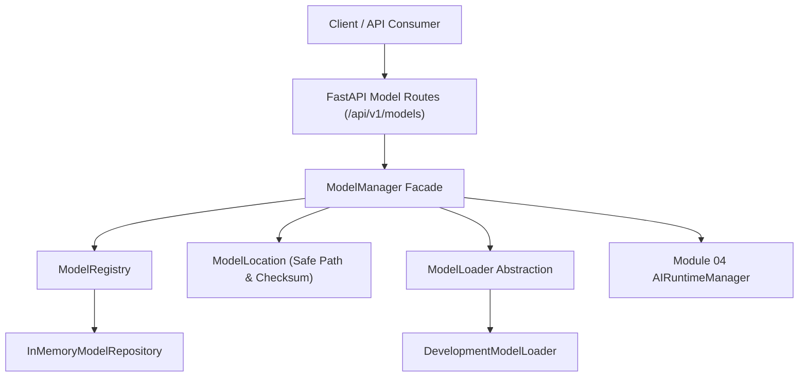
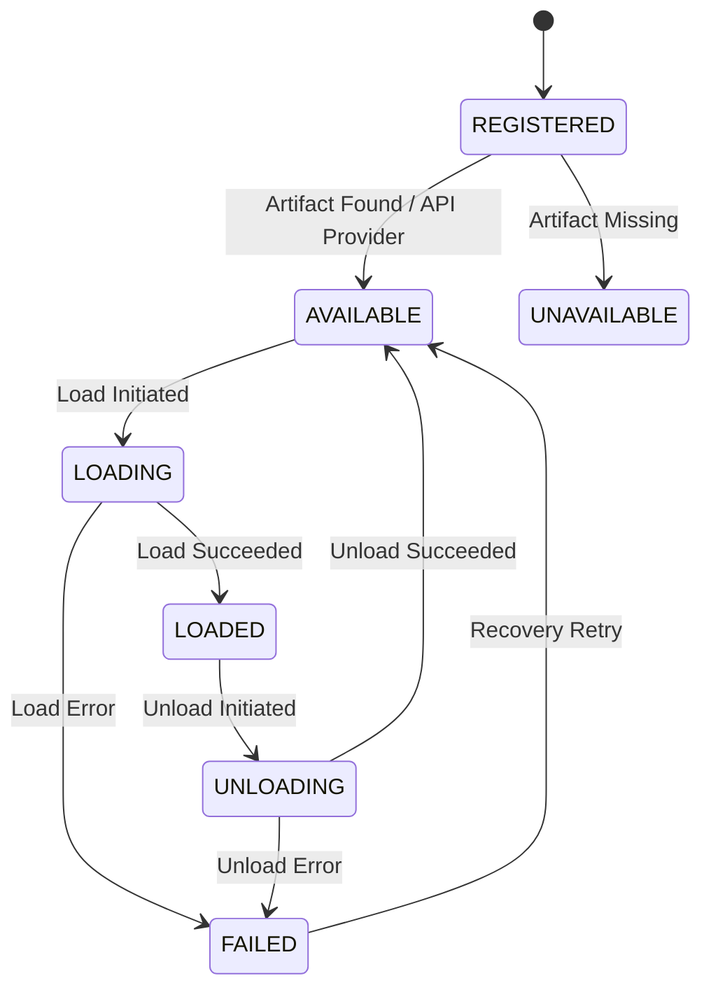

# Module 05 — Model Management

## 1. Purpose

The Model Management module provides a provider-neutral model registry, artifact inventory, hardware requirement validation, lifecycle tracking, loader abstraction, and resolution service within the MADHAV Personal AI platform.

It answers fundamental model governance questions:
- *What models exist and what are their metadata properties?*
- *What capabilities (text, vision, streaming, tool calling) does each model possess?*
- *What system resources (RAM, VRAM, CPU/GPU) does a model require?*
- *Is the model artifact installed on disk, available, or loaded in memory?*
- *Which Module 04 AI Runtime backend can execute this model?*

## 2. Scope & Non-Responsibilities

### Responsibilities
- **Model Registry & Indexing**: Indexing model definitions, metadata, identifiers, and semantic versions.
- **Artifact & Location Management**: Tracking model storage formats (`GGUF`, `SAFETENSORS`, `ONNX`, `API`), paths, and checksum integrity (`SHA-256`). Safe path handling prevents path traversal outside the configured model root (`MADHAV_MODEL_DIRECTORY`).
- **Lifecycle Management**: Validating and enforcing state transitions across `REGISTERED`, `AVAILABLE`, `LOADING`, `LOADED`, `UNLOADING`, `UNAVAILABLE`, and `FAILED`.
- **Loader Abstraction**: Provider-neutral `ModelLoader` interface with async concurrency protection preventing race conditions.
- **Runtime Compatibility**: Verifying model requirements against hardware profiles and checking capability compatibility against Module 04 `ModelRuntime` backends.
- **Offline Development Engine**: Pre-registers `development-stub` on startup, operating 100% offline without external API keys or GPU hardware.

### Non-Responsibilities
- **Model Execution**: Inference execution belongs exclusively to Module 04 AI Runtime.
- **Model Downloads**: Remote weight downloading belongs to operational tooling or future acquisition services.
- **Model Routing**: Intelligent model selection based on prompt intent belongs to Context & Reasoning modules (Module 06+).

## 3. Architecture Diagram

## 4. Lifecycle State Machine

## 5. Core Domain Entities

- `ModelIdentifier`: Unique model ID, provider, display name, semantic version, and revision.
- `ModelCapabilities`: Declarative capability flags (`text_generation`, `chat`, `streaming`, `vision`, `embeddings`, `tool_calling`, `structured_output`, `reasoning`).
- `ModelRequirements`: System hardware requirements (`minimum_ram_gb`, `minimum_vram_gb`, `cpu_required`, `gpu_required`, `context_length`).
- `ModelArtifact`: Storage artifact descriptor (`format`, `path`, `size_bytes`, `checksum`).
- `ModelStatus`: Comprehensive diagnostic status snapshot (`model_id`, `lifecycle_state`, `is_available`, `is_loaded`, `target_runtime`, `capabilities`, `format`).
- `Model`: Core aggregate entity encapsulating identity, capabilities, requirements, artifact, and lifecycle state.

## 6. API Endpoints

| Method | Endpoint Path | Description |
| :--- | :--- | :--- |
| `GET` | `/api/v1/models` | List registered model definitions (with optional provider/state filters). |
| `POST` | `/api/v1/models` | Register a new model definition metadata. |
| `GET` | `/api/v1/models/{model_id}` | Retrieve model details by ID. |
| `PATCH` | `/api/v1/models/{model_id}` | Update model metadata (prohibited if model is in `LOADED` state). |
| `DELETE` | `/api/v1/models/{model_id}` | Unregister model definition (preserves files on disk). |
| `POST` | `/api/v1/models/{model_id}/load` | Load model into operational state. |
| `POST` | `/api/v1/models/{model_id}/unload` | Unload model from operational state. |
| `GET` | `/api/v1/models/{model_id}/status` | Retrieve detailed model diagnostic status. |
| `GET` | `/api/v1/models/{model_id}/capabilities` | Retrieve model capabilities matrix. |
| `POST` | `/api/v1/models/{model_id}/verify` | Verify artifact SHA-256 checksum integrity. |
