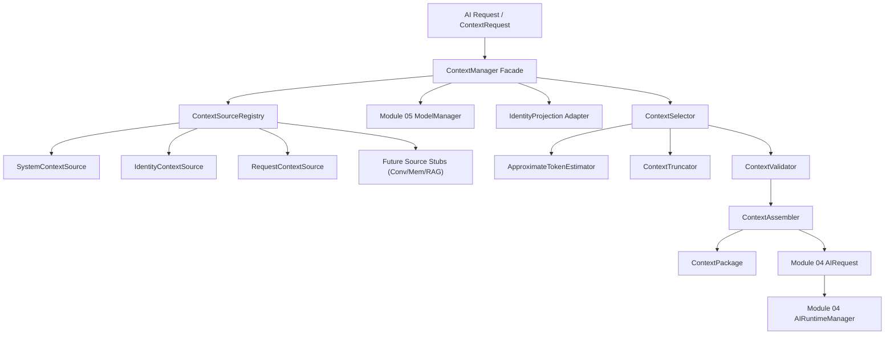

# Module 06 — Context Management

## 1. Purpose

Module 06 Context Management is the subsystem responsible for determining, assembling, validating, prioritizing, budgeting, and packaging information supplied to an AI model for inference requests.

It answers the fundamental input preparation question:
- *What information should be provided to the selected AI model for this execution request?*

### Distinct Architectural Boundaries

- **Module 03 (Identity)**: Who is the user?
- **Module 04 (AI Runtime)**: How is inference executed?
- **Module 05 (Model Management)**: Which models exist and what are their context limits?
- **Module 06 (Context Management)**: What information should be packaged for model input?
- **Module 07 (Conversation)**: How are conversation threads managed? *(Future)*
- **Module 08 (Memory)**: What long-term memories are stored? *(Future)*
- **Module 09/10 (Knowledge & RAG)**: What documents are retrieved? *(Future)*

## 2. Responsibilities & Non-Responsibilities

### Responsibilities
- **Context Request Processing**: Receiving candidate context inputs, user requests, model references, and policy rules.
- **Privacy-Aware Identity Projection**: Converting Module 03 `IdentityContext` into safe context items while shielding sensitive attributes (email, phone, DOB) unless allowed by explicit policy.
- **Model Context-Limit Integration**: Resolving target model `context_length` from Module 05 `ModelManager` to compute exact net input token budgets.
- **Offline Token Estimation**: Providing deterministic token estimates via `ApproximateTokenEstimator`.
- **Deterministic Selection & Budget Allocation**: Prioritizing items (`CRITICAL` > `HIGH` > `NORMAL` > `LOW` > `OPTIONAL`), deduplicating content, and selecting candidate items to fit allocated token budgets.
- **Safe Truncation**: Truncating oversized items using strategies (`TAIL`, `HEAD`, `HEAD_AND_TAIL`) while marking metadata and preserving required items.
- **Message Assembly**: Converting selected `ContextItem`s into ordered Module 04 `AIMessage`s and constructing `ContextPackage` / `AIRequest`.
- **Package Validation**: Validating request presence, non-empty content, budget bounds, and required item inclusion.
- **Diagnostic Inspection**: Exposing REST API endpoints (`/api/v1/context/build`, `/sources`, `/policies`) for diagnostic inspection without leaking private prompt details.

### Non-Responsibilities
- **Persistence & Databases**: No PostgreSQL, Redis, vector databases, or disk persistence for conversation history or memory.
- **External LLM Calls**: No network requests or model inference execution.
- **Memory Storage**: No memory database or long-term recall.
- **RAG & Vector Search**: No document chunking, embeddings, or semantic search.

## 3. Architecture Pipeline



## 4. Context Pipeline Flow

```
                  ContextRequest
                        │
                        ▼
                Context Manager
                        │
             ┌──────────┼──────────┐
             ▼          ▼          ▼
        Context      Context     Context
        Sources      Policy      Budget (from Mod 05 Model)
             │          │          │
             └──────────┼──────────┘
                        ▼
                Context Selection
           (Deduplicate / Sort / Budget)
                        │
                        ▼
                Context Truncation
                        │
                        ▼
                Context Validation
                        │
                        ▼
                 Context Package
                        │
                        ▼
              Module 04 AIRequest
                        │
                        ▼
                Module 04 AI Runtime
```

## 5. Domain Abstractions

- `ContextItem`: Discrete unit of context holding `context_id`, `category`, `content`, `priority`, `required`, `source`, `token_estimate`, `trust_level`, `metadata`, `created_at`, `expires_at`, and `content_hash`.
- `ContextCategory`: Taxonomy values: `SYSTEM`, `IDENTITY`, `REQUEST`, `CONVERSATION`, `MEMORY`, `KNOWLEDGE`, `INSTRUCTION`, `TOOL_RESULT`, `OTHER`.
- `ContextPriority`: Priority levels: `CRITICAL` (5), `HIGH` (4), `NORMAL` (3), `LOW` (2), `OPTIONAL` (1).
- `ContextBudget`: Calculation holding `max_tokens`, `reserved_tokens`, `safety_margin`, and `available_input_tokens`. Formula: `max(0, max_tokens - reserved_tokens - safety_margin)`.
- `ContextPolicy`: Rules specifying `allowed_categories`, `required_categories`, `priority_order`, `truncation_strategy`, `max_items`, `max_item_tokens`, `deduplicate`, and `allow_sensitive_identity`. Presets: `default`, `minimal`, `full`.
- `ContextPackage`: Final outcome containing `request_id`, `messages` (Module 04 `AIMessage`), `items`, `token_estimate`, `budget`, `truncated_items`, `dropped_items`, and diagnostic `ContextSelectionReport`.

## 6. Integration with Modules 01–05

- **Module 01**: Extends central exception hierarchy (`MadhavException`) with module-specific `ContextError` types.
- **Module 02**: Configured via `ContextManagementSettings` mounted in root `Settings` (`MADHAV_CONTEXT_DEFAULT_MAX_TOKENS`, `MADHAV_CONTEXT_RESERVED_OUTPUT_TOKENS`, `MADHAV_CONTEXT_SAFETY_MARGIN_TOKENS`, `MADHAV_CONTEXT_MAX_ITEMS`, `MADHAV_CONTEXT_MAX_ITEM_TOKENS`, `MADHAV_CONTEXT_DEBUG_ENABLED`).
- **Module 03**: Consumes `IdentityContext` safely via `IdentityProjection`.
- **Module 04**: Converts selected context items into `AIMessage` list and builds `AIRequest` for `AIRuntimeManager.execute()`.
- **Module 05**: Queries `ModelManager` to read model `requirements.context_length` dynamically.

## 7. Future Module Extension Points

- `ConversationContextSource`: Module 07 integration point for supplying recent chat turns.
- `MemoryContextSource`: Module 08 integration point for supplying relevant long-term memories.
- `KnowledgeContextSource`: Module 09/10 integration point for supplying retrieved RAG document chunks.
- `ToolResultContextSource`: Future tool calling integration point.

## 8. REST API Endpoints

| Method | Endpoint Path | Description |
| :--- | :--- | :--- |
| `POST` | `/api/v1/context/build` | Build and inspect a context package and diagnostic selection report. |
| `GET` | `/api/v1/context/sources` | List registered context sources and active status. |
| `GET` | `/api/v1/context/policies` | List available context policy presets (`default`, `minimal`, `full`). |
