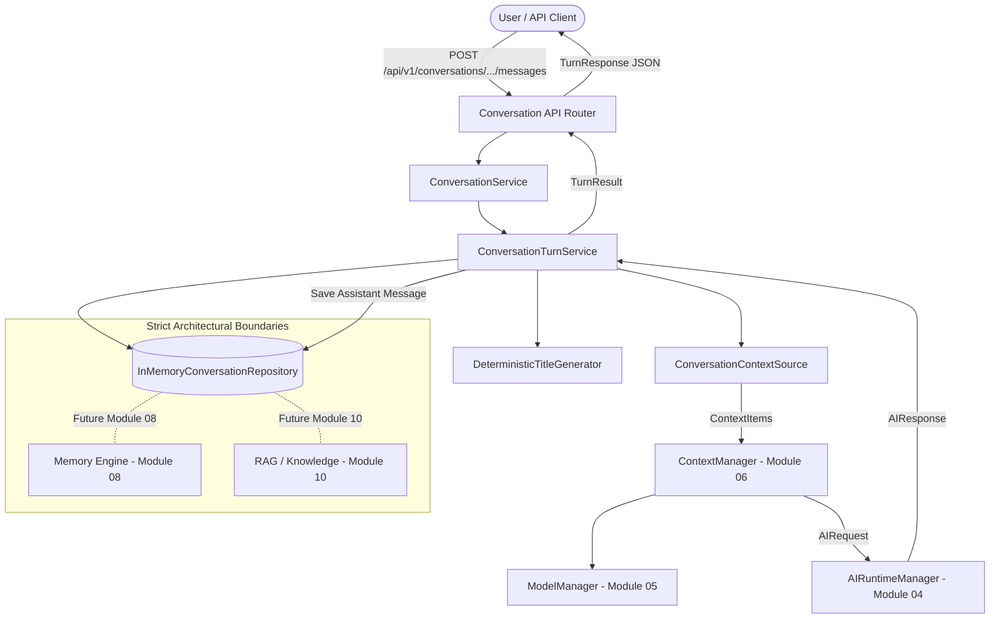

# MODULE 07 — CONVERSATION ENGINE ARCHITECTURE DOCUMENTATION

## 1. Purpose

The Conversation Engine manages structured, stateful conversation threads, chronological message histories, message sequence generation, deterministic title generation, and turn orchestration for the MAX Personal AI System.

It serves as the definitive source of active conversational context and historical turns without blurring boundaries into long-term memory, knowledge retrieval, or reasoning engines.

---

## 2. Scope

### In Scope
- Conversation aggregate creation, retrieval, updates, archiving, restoration, and soft deletion.
- Chronological message creation, sequence ordering, and lifecycle tracking (`PENDING`, `PROCESSING`, `COMPLETED`, `FAILED`, `CANCELLED`).
- Deterministic title generation on first turn (LLM-free).
- Pagination and history retrieval boundaries.
- Idempotent turn requests via `client_message_id`.
- Adapter integration with Module 06 Context Management (`ConversationContextSource`).
- Turn orchestration invoking Module 04 AI Runtime via Module 06 prepared requests.
- Thread/async safe in-memory storage fallback.
- OpenAPI documented REST endpoints under `/api/v1/conversations`.

### Out of Scope (Non-Goals)
- Long-term memory extraction or persistence (Module 08).
- Personal knowledge base & dynamic profile updates (Module 09).
- RAG, vector embeddings, or semantic search (Module 10).
- Reasoning, planning, and agent execution loops (Module 11).
- Tool execution (Module 12+).
- User authentication / JWT login mechanisms.
- PostgreSQL database infrastructure.

---

## 3. Conversation Domain

### Conversation Model
`Conversation` represents a top-level conversation session owned by an identity:
- `conversation_id`: Stable UUID primary key.
- `owner_id`: Reference to identity owner (Module 03).
- `title`: Optional human-readable title.
- `status`: `ConversationStatus` (`ACTIVE`, `ARCHIVED`, `DELETED`).
- `settings`: `ConversationSettingsModel` (`model_reference`, `context_policy`, `auto_title_enabled`).
- `message_count`: Total persisted messages count.
- `created_at`, `updated_at`, `last_message_at`, `deleted_at`: UTC ISO timestamps.
- `metadata`: Safe arbitrary attributes dictionary.

---

## 4. Message Domain

### Message Model
`Message` represents an individual message entry in a conversation thread:
- `message_id`: Unique UUID.
- `conversation_id`: Parent conversation UUID.
- `sequence`: Monotonically increasing sequence number per conversation.
- `role`: `MessageRole` (`SYSTEM`, `USER`, `ASSISTANT`, `TOOL`).
- `content`: Textual message body.
- `status`: `MessageStatus` (`PENDING`, `PROCESSING`, `COMPLETED`, `FAILED`, `CANCELLED`).
- `client_message_id`: Idempotency key supplied by client.
- `created_at`, `updated_at`: UTC ISO timestamps.
- `metadata`: Execution metrics, model name, provider, latency, token usage.

---

## 5. Lifecycle States & Transitions

### Conversation Lifecycle
```
      ┌──────────┐
      │  ACTIVE  │
      └────┬─────┘
           │
     ┌─────┴─────┐
     ▼           ▼
┌──────────┐ ┌──────────┐
│ ARCHIVED │ │ DELETED  │
└────┬─────┘ └──────────┘
     │           ▲
     └───────────┘
```
- `ACTIVE` -> `ARCHIVED`: Archived conversations reject new messages unless restored.
- `ARCHIVED` -> `ACTIVE`: Conversation restored to active state.
- `ACTIVE` / `ARCHIVED` -> `DELETED`: Soft deleted (marked with `deleted_at`). Terminal state.

### Message Lifecycle
```
PENDING ──► PROCESSING ──► COMPLETED
                 │
                 ├──► FAILED
                 │
                 └──► CANCELLED
```

---

## 6. Sequence Management & Concurrency

- Sequence numbers start at `1` for each conversation and increment monotonically.
- Sequences are managed per-conversation, protected by per-conversation `asyncio.Lock` primitives in `InMemoryConversationRepository`.
- Guarantees deterministic chronological message ordering regardless of sub-millisecond timestamp collisions.

---

## 7. Architecture Diagram



---

## 8. Development Persistence vs Production Storage

```
Current Development Persistence
              ↓
InMemoryConversationRepository (Async / Thread Safe)
              ↓
Future Production Storage Interface
              ↓
PersistentConversationRepository
              ↓
PostgreSQL / Relational Database (Future)
```

No external database drivers (SQLAlchemy, Alembic, PostgreSQL) are added in Module 07, ensuring complete isolation and 100% offline testability.

---

## 9. Integration with Modules 01-06

1. **Module 01 Platform Foundation**: Reuses `MaxException`, standard `APIResponse[T]`, request IDs, and logging.
2. **Module 02 Configuration**: Uses `ConversationSettings` from global `Settings`.
3. **Module 03 Identity**: References `owner_id` and gets `IdentityContext` snapshot from `IdentityService`.
4. **Module 04 AI Runtime**: Executes inference via `AIRuntimeManager.generate(ai_request)`.
5. **Module 05 Model Management**: Validates model references and context length capabilities via `ModelManager`.
6. **Module 06 Context Management**: Converts conversation history into `ContextItem` instances via `ConversationContextSource` and prepares `AIRequest`.

---

## 10. Verification & Quality

- **Unit Tests**: Domain models, sequence generation, title generation, repository operations, service facade.
- **Integration Tests**: REST API endpoints, error handling, idempotency checks.
- **End-to-End Tests**: Multi-turn conversation flow verifying prior turns are included in AI Runtime context.
- **Concurrency Tests**: Parallel message creation verifying sequence uniqueness.
- **Code Quality**: Clean passing `pytest`, `ruff`, and strict `mypy`.
