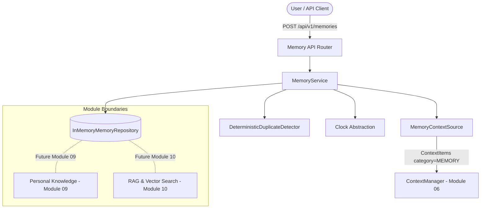

# MODULE 08 — MEMORY ENGINE ARCHITECTURE DOCUMENTATION

## 1. Purpose

The Memory Engine provides persistent long-term memory infrastructure for the MAX Personal AI System. It enables explicit memory creation, deterministic duplicate detection, lifecycle state management (`ACTIVE`, `ARCHIVED`, `EXPIRED`, `DELETED`), access tracking (`last_accessed_at`), search filtering, and integration with Module 06 Context Management via `MemoryContextSource`.

It maintains a clean boundary separating memory storage from conversation histories, personal knowledge bases, RAG/vector search, and AI reasoning loops.

---

## 2. Scope

### In Scope
- Memory aggregate modeling with typed categories (`FACT`, `PREFERENCE`, `PERSONAL`, `GOAL`, `HABIT`, `DECISION`, `EXPERIENCE`, `RELATIONSHIP`, `INSTRUCTION`, `CONSTRAINT`, `OTHER`).
- Lifecycle management and valid state transitions (`ACTIVE`, `ARCHIVED`, `EXPIRED`, `DELETED`).
- Access tracking (`last_accessed_at`) updated upon retrieval.
- Deterministic duplicate memory detection using text SHA-256 fingerprinting and token overlap ratios.
- Time abstraction (`Clock`, `SystemClock`, `TestClock`) for deterministic expiration evaluation.
- `MemoryContextSource` adapter providing candidate memories to Module 06 `ContextManager`.
- Async and thread-safe development persistence (`InMemoryMemoryRepository`).
- REST API endpoints under `/api/v1/memories`.

### Out of Scope (Non-Goals)
- LLM-driven automatic memory extraction or reasoning.
- Vector database, embeddings, or semantic similarity search (Module 10 RAG).
- Structured personal profile knowledge updates (Module 09).
- Background scheduled expiration cleanup jobs.
- PostgreSQL database drivers or external storage engines.

---

## 3. Domain Model

### Memory Aggregate Root
`Memory`:
- `memory_id`: Stable UUID identifier.
- `owner_id`: Owner identity identifier (Module 03).
- `type`: `MemoryType`.
- `content`: `MemoryContent` (`text`, `structured_data`, `content_type`, SHA-256 `content_hash`).
- `status`: `MemoryStatus` (`ACTIVE`, `ARCHIVED`, `EXPIRED`, `DELETED`).
- `importance`: `MemoryImportance` (`LOW`, `NORMAL`, `HIGH`, `CRITICAL`).
- `confidence`: `MemoryConfidence` (`LOW`, `MEDIUM`, `HIGH`).
- `source`: `MemorySource` (`USER_EXPLICIT`, `USER_CONVERSATION`, `SYSTEM`, `IMPORTED`, `MANUAL`, `FUTURE_AI_INFERENCE`).
- `scope`: `MemoryScope` (`USER`).
- `metadata`: `MemoryMetadata` (`tags`, `source_reference`, `conversation_id`, `message_id`, `origin`, `created_by`, `custom_metadata`).
- `created_at`, `updated_at`, `last_accessed_at`, `expires_at`, `archived_at`, `deleted_at`: UTC ISO timestamps.

---

## 4. Lifecycle & State Transitions

```
      ┌──────────┐
      │  ACTIVE  │
      └────┬─────┘
           │
  ┌────────┼────────┬────────┐
  ▼        ▼        ▼        ▼
┌────┐ ┌───────┐ ┌─────┐ ┌───────┐
│ARCH│ │EXPIRED│ │RESTO│ │DELETED│
└────┘ └───────┘ └─────┘ └───────┘
```
- `ACTIVE` -> `ARCHIVED`: Archived records preserved for explicit retrieval.
- `ACTIVE` -> `EXPIRED`: Records past `expires_at` timestamp.
- `ARCHIVED` / `EXPIRED` -> `ACTIVE`: Restored to active state.
- `ACTIVE` / `ARCHIVED` / `EXPIRED` -> `DELETED`: Soft deleted (marked with `deleted_at`). Terminal state.

---

## 5. Duplicate Detection & Expiration

### Duplicate Detection
`DeterministicDuplicateDetector` checks candidate content against active memories:
1. Exact SHA-256 hash match -> `match_type="exact_hash"`, `similarity_score=1.0`.
2. Token Jaccard overlap ratio >= 0.85 -> `match_type="text_overlap"`, `similarity_score=ratio`.
3. Returns `MemoryDuplicateResult` without executing LLMs or embedding models.

### Expiration Evaluation
- Uses `Clock` abstraction (`now() >= memory.expires_at`).
- Evaluated deterministically during retrieval queries or explicit expiration endpoints.

---

## 6. Architecture Diagram



---

## 7. Development vs Production Persistence

```
Current Development Persistence
              ↓
InMemoryMemoryRepository (Async / Thread Safe)
              ↓
Future Production Storage Interface
              ↓
PersistentMemoryRepository
              ↓
PostgreSQL / Relational Database (Future)
```

---

## 8. Integration with Module 06 Context Management

`MemoryContextSource` converts candidate memories into `ContextItem` objects (`category=MEMORY`):
- `HIGH` priority assigned if memory importance is `HIGH` or `CRITICAL`.
- Candidate items pass into `ContextManager.build_context()` respecting token budget and truncation policies.

---

## 9. Privacy Safeguards

- Memory text content is strictly redacted from default structured log outputs (`memory_id`, `type`, `owner_id`, `status` logged instead).
- Sensitive credentials or tokens are forbidden in metadata attributes.
