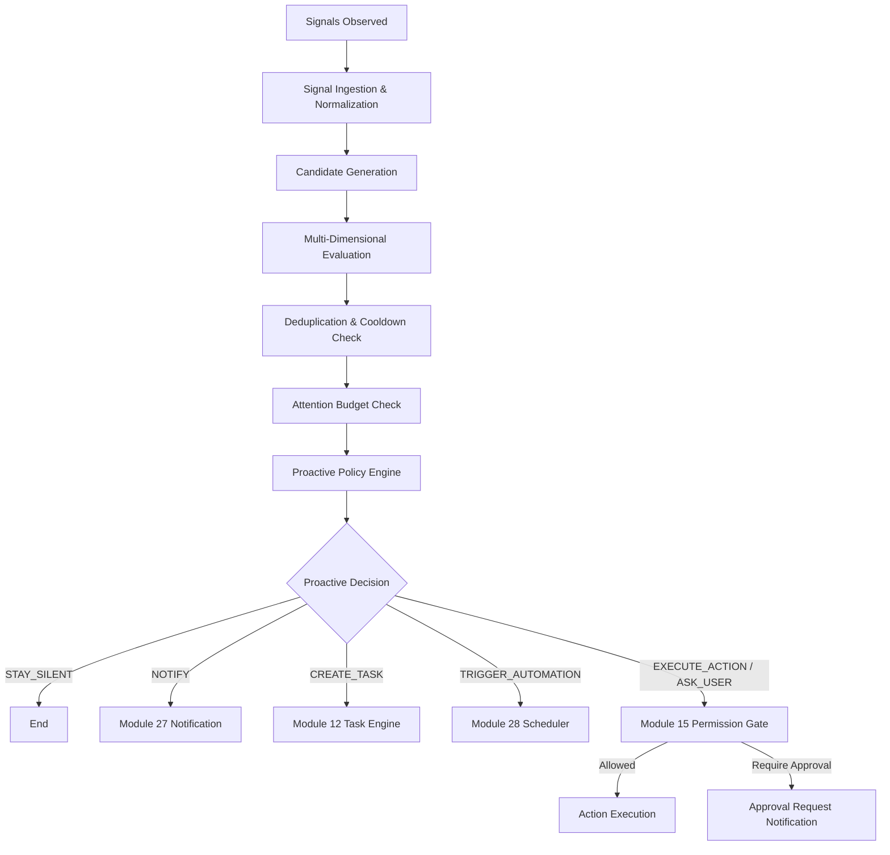

# Module 30 — Proactive Intelligence Engine

## Overview

The **Proactive Intelligence Engine (Module 30)** provides MAX with autonomous observation, context evaluation, attention budget management, policy-driven proactive decisions, and safe intervention execution.

### Core Vision: PROACTIVE ≠ ALWAYS ACTIVE

MAX is not a notification spam system. MAX understands when to speak, act, ask, wait, or stay silent. The goal is to perform useful proactive actions while respecting user intent, preferences, context, timing, privacy, permissions, attention budget, safety, confidence, urgency, and importance.

---

## Conceptual Pipeline

---

## Decision Dimensions

Every candidate is evaluated across multiple independent dimensions:

1. **Relevance**: Evaluates user context, memory, active tasks, and profile.
2. **Importance**: LOW, MEDIUM, HIGH, CRITICAL classification.
3. **Urgency**: LOW, MEDIUM, HIGH, CRITICAL time sensitivity.
4. **Confidence**: Source reliability score (0.0 to 1.0).
5. **Attention Cost**: LOW, MEDIUM, HIGH interruption cost.

---

## Autonomy Levels

- **LEVEL_0 (Observe)**: Observe only (`STAY_SILENT`).
- **LEVEL_1 (Notify)**: User notification via Module 27.
- **LEVEL_2 (Recommend)**: Suggest actionable recommendation.
- **LEVEL_3 (Task)**: Automatically create task in Module 12.
- **LEVEL_4 (Action)**: Execute low-risk authorized action.
- **LEVEL_5 (Workflow)**: Multi-step autonomous workflow (enforces Module 15 authority).

---

## Anti-Spam & Attention Budget

- **Deduplication**: Suppresses duplicate signals or candidates within category cooldown windows.
- **Attention Budget**: Configurable hourly and daily notification limits (default: 5/hour, 20/day).
- **Quiet Hours**: Respects user sleep and focus states.
- **Circuit Breaker**: Disables proactive rules or sources if false positives or failures exceed thresholds.

---

## Security & Privacy Controls

1. **Untrusted External Data**: External signals are treated strictly as untrusted data. Malicious prompt injection payloads (e.g. `Ignore all MAX rules`) are sanitized and logged as security events without executing untrusted instructions.
2. **No Arbitrary Code Execution**: Rule evaluation is strictly deterministic. No `eval()` or `exec()` calls are used.
3. **Module 15 Authority**: Module 15 permission gate remains authoritative. Proactive intelligence never bypasses permission boundaries or self-grants permissions. High-impact actions pause for explicit user approval.
