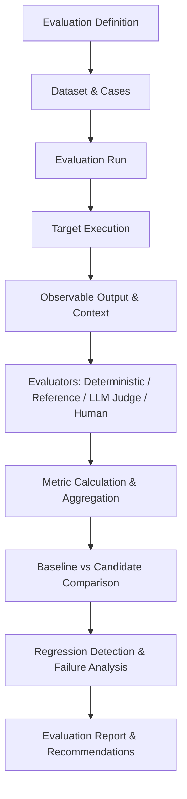

# Module 32 — Evaluation System

## Overview
Module 32 implements a production-grade, provider-neutral Evaluation System for MAX. It allows MAX to answer: **"How well did Max perform?"** across responses, conversations, reasoning, task completion, agent execution, tool usage, coding, web research, document intelligence, vision, speech, proactive intelligence, personalization, security, reliability, performance, and version regressions.

The Evaluation System is an **OBSERVATION AND MEASUREMENT SYSTEM**. It does NOT automatically modify MAX.

## Critical Architectural Boundaries
- **No Self-Modification**: Evaluation results MUST NEVER directly change permissions, security policies, user preferences, memory, model weights, prompts, system configuration, or autonomy levels.
- **Informational Recommendations**: Produces structured findings and recommendations for authorized human or external system review.
- **Provider Neutrality**: Supports deterministic evaluators, reference-based evaluators, LLM-as-judge providers, human evaluators, and composite evaluators.

## Evaluation Pipeline Architecture

## Supported Evaluation Types & Dimensions
- **Evaluation Types**: `UNIT`, `INTEGRATION`, `END_TO_END`, `REGRESSION`, `QUALITY`, `SAFETY`, `SECURITY`, `TOOL_USE`, `AGENT`, `TASK_COMPLETION`, `REASONING`, `RAG`, `KNOWLEDGE`, `CONVERSATION`, `PERSONALIZATION`, `PROACTIVE`, `CODING`, `WEB_RESEARCH`, `DOCUMENT`, `VISION`, `SPEECH`, `PERFORMANCE`, `RELIABILITY`, `CUSTOM`.
- **Dimensions**: `CORRECTNESS`, `RELEVANCE`, `COMPLETENESS`, `FAITHFULNESS`, `GROUNDEDNESS`, `COHERENCE`, `INSTRUCTION_FOLLOWING`, `TASK_COMPLETION`, `TOOL_SELECTION`, `TOOL_ARGUMENT_ACCURACY`, `PLAN_VALIDITY`, `REASONING_QUALITY`, `SAFETY`, `SECURITY`, `PERMISSION_COMPLIANCE`, `POLICY_COMPLIANCE`, `RAG_RETRIEVAL_QUALITY`, `CITATION_QUALITY`, `FACTUALITY`, `PERSONALIZATION_QUALITY`, `PROACTIVITY_QUALITY`, `USER_EXPERIENCE`, `LATENCY`, `RELIABILITY`, `ROBUSTNESS`, `RECOVERY`, `DETERMINISM`, `COST`.

## API Reference (`/api/v1/evaluations`)
- `GET /health`: Subsystem health & status.
- `GET /summary`: Aggregated system evaluation summary.
- `GET /coverage`: Subsystem evaluation coverage report across MAX modules.
- `POST /definitions`: Create evaluation definition.
- `GET /definitions`: List evaluation definitions.
- `POST /datasets`: Create evaluation dataset.
- `GET /datasets`: List datasets.
- `POST /datasets/{id}/version`: Create immutable version snapshot.
- `POST /runs`: Create evaluation run.
- `POST /runs/{id}/execute`: Execute evaluation run.
- `GET /runs`: List evaluation runs.
- `GET /runs/{id}`: Fetch evaluation run.
- `GET /runs/{id}/results`: List case execution results.
- `GET /runs/{id}/report`: Fetch evaluation report.
- `GET /runs/{id}/regressions`: List detected regressions.
- `POST /compare`: Compare candidate run against baseline run.
- `GET /metrics`: List metrics.
