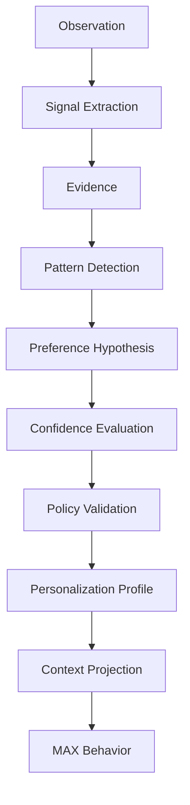

# Module 31 — Learning & Personalization Engine

## Overview
Module 31 implements a production-grade Learning & Personalization Engine for MAX. It allows MAX to learn user behavioral preferences over time, construct adaptive personalization profiles, and customize communication styles, notification timing, proactive thresholds, workflow patterns, and tool rankings without ever creating unauthorized security permissions or storing sensitive personal inferences.

## Core Vision & Fundamental Distinction
- **Memory (Module 08)**: "What happened?"
- **Personal Knowledge (Module 09)**: "What facts/relationships are known?"
- **Personalization (Module 31)**: "How does the user prefer MAX to behave?"
- **Learning (Module 31)**: "What behavioral pattern has MAX inferred from evidence?"
- **Model Training (Module 40)**: "How are model parameters changed?"

## Personalization Pipeline Architecture

## Core Security & Safety Boundaries
1. **Security Authority**: Learning can NEVER create authority, grant permissions (ALLOW), bypass Module 15 security checks, or alter security policies.
2. **Sensitive Inference Boundary**: Prohibits inferring or storing forbidden sensitive personal traits (medical/health conditions, political affiliations, religious beliefs, sexual orientation, or protected demographic traits).
3. **Explicit Precedence**: Explicit user statements and corrections ALWAYS override inferred preferences.

## Learning Modes
- `OFF`: Automated behavioral learning disabled.
- `EXPLICIT_ONLY`: Only direct user statements recorded and applied.
- `ASSISTED`: Inferred hypotheses suggested for confirmation before promotion.
- `ADAPTIVE`: Highly confident hypotheses automatically promoted according to policy.

## Precedence Model
1. Security Policy (Module 15 / Security Boundaries)
2. Explicit User Restriction (Disabled category)
3. Explicit User Preference
4. User Correction
5. Active Learned Preference
6. Contextual Preference
7. Historical Pattern
8. System Default

## API Reference (`/api/v1/personalization`)
- `GET /profile`: Retrieve active personalization profile.
- `GET /preferences`: List preferences.
- `POST /preferences`: Create explicit preference.
- `PUT /preferences/{id}`: Update preference.
- `DELETE /preferences/{id}`: Delete preference.
- `POST /preferences/{id}/confirm`: Confirm hypothesis/preference.
- `POST /preferences/{id}/reject`: Reject hypothesis/preference.
- `POST /preferences/{id}/correct`: Correct preference value.
- `GET /preferences/{id}/evidence`: View preference evidence.
- `GET /hypotheses`: List active hypotheses.
- `GET /learning-signals`: List raw learning signals.
- `POST /feedback`: Post personalization feedback.
- `GET /settings`: View personalization configuration state.
- `PUT /settings`: Update configuration settings.
- `POST /pause-learning`: Pause automated learning.
- `POST /resume-learning`: Resume automated learning.
- `POST /reset-inferred`: Reset all inferred preferences.
- `POST /reset-category`: Reset preferences in a category.
- `POST /simulate`: Dry-run signal simulation.
- `GET /history`: View audit log history.
